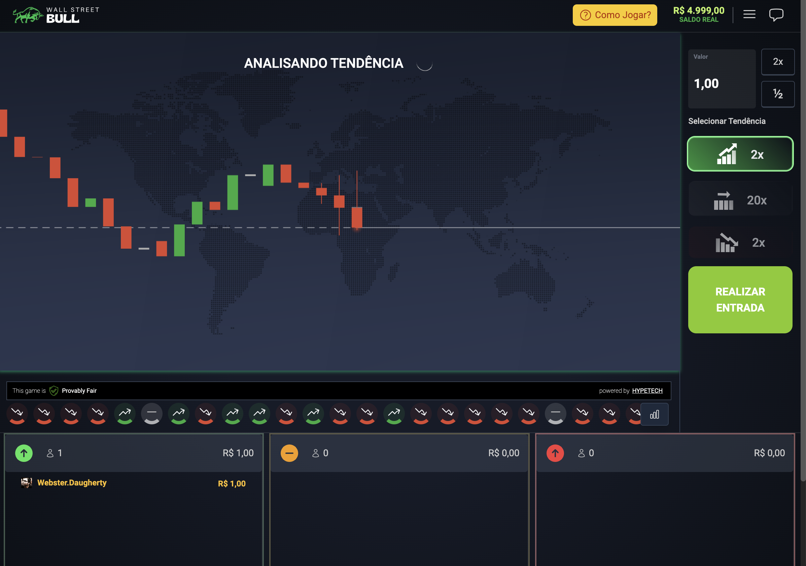

<p align="center">
  
</p>

<p align="center">
  <a href="LICENSE"></a>
</p>

## 💻 Projeto

A Aplicação é um teste de codificação ***Hypetech*** desenvolvido pela empresa que consistem em melhorar o layout do Wallstreet e assim demonstrar as minhas habilidades no desenvolvimento front-end.

O Wallstreet é um jogo de predição de tendência, inspirado na plataforma IQ Option. O Objetivo é "adivinhar" qual será a próxima tendência do mercado: subir, descer, ou manter (Bull).

Caso o jogador acerte as tendências de Subida ou Descida, seu prêmio é o valor apostado 2x. Caso acerte a tendência Bull, seu prêmio é o valor apostado 20x.




<br><br>

### ⚡ Melhorias Implementadas:
---

- Botões de Tendências foram estilizados semanticamente com ícones intuitivos.

- Foi adicionado uma estilização mais moderna e atraente nos Botões "Realizar Entrada", "Como Jogar" e nos Controles de Alteração de Valores da Aposta.

- O valores em moeda corrente apresentados na aplicação receberam formatação no padrão Brasileiro.

- Os Cards com a **Lista de Apostadores da Rodada** teve algumas atualizações importantes:
  - Cada card ganhou ícones intuitivos e cores personalizadas em sua borda.
  - É mostrado o avatar do apostador ao lado do nome.
  - Quando o usuário da sessão está na lista, seu registro é mostrado em destaque.

- A Mensagem do **Resultado da Rodada** ficou com um visual mais vibrante.

- O Jogador quando acerta a aposta agora recebe uma mensagem com animação, valorizando assim mais a sua conquista.

<br>

## ✨ Tecnologia

- [TypeScript](https://www.typescriptlang.org/)
- [React](https://reactjs.org/)
- [Vite](https://vitejs.dev/)
- [Tailwind CSS](https://tailwindcss.com/)
- [React Redux](https://react-redux.js.org/)
- E muitas outras…

## 🚀 Como executar

### 1. Clone o repositório:
```bash
git clone https://github.com/hypetechgames/frontend-challenge
```

### 2. Instale as dependências e inicie o projeto

Acesse a pasta do projeto:
```bash
cd frontend-challenge
```

Instale as dependências do projeto:
```bash
yarn install
```

Inicie o projeto:
```bash
yarn dev
```

### 3. Obtendo um token de acesso ao jogo

Para acessar o jogo é necessário obter um token de acesso que cria uma sessão demonstrativa funcional para desenvolvimento.

Para obtê-lo:

**1 - Acesse a API de Demonstração:** 
 https://hypetech-demo-api-service-developer.up.railway.app/docs/

**2 - Obtenha um link de demonstração:**	

	{ "gameUrl": "https://hypetech-games-ui-developer.up.railway.app/44cdf4cec80508c531f71a1929d591c8" }

**3 - Extraia o token obtido:**
~~https://hypetech-games-ui-developer.up.railway.app/~~**44cdf4cec80508c531f71a1929d591c8**


Exemplo: https://i.ibb.co/fp07Mxs/Screen-Recording-2024-01-08-at-17-59-36.gif


**Obs:** Para cada jogo que desejar carregar, você deve gerar um novo token, alterando o parâmetro "game" da requisição:

 ```json
"game": "wall-street",
"lang": "pt",
"currency": "BRL"
```

**4 - Acesse o jogo:**
Uma vez obtido o token, utilize-o no seu ambiente de desenvolvimento:

**Exemplo - URL do seu ambiente:** http://localhost:8000/
**Exemplo - URL do jogo no seu ambiente:** http://localhost:8000/2b29acad3f7a1e6b0995155668719e66

Caso encontre dificuldade em obter o token seguindo processo acima, você poderá utilizar os tokens públicos abaixo *(ciente que outros desenvolvedores podem estar utilizando a mesma sessão ao mesmo tempo)*:

**WallStreet:** 294f24f2c661fc80fd6d12845a3ccdd6

Isso é tudo. A partir de agora você pode acessar o jogo e explorar todas as funcionalidades de forma completa durante seu desenvolvimento.

## 📝 License

Esse projeto está sob a licença MIT. Veja o arquivo [LICENSE](LICENSE) para mais detalhes.

---

<p align="center">
  Feito com 💙 by Dárcio Carvalho 
</p>